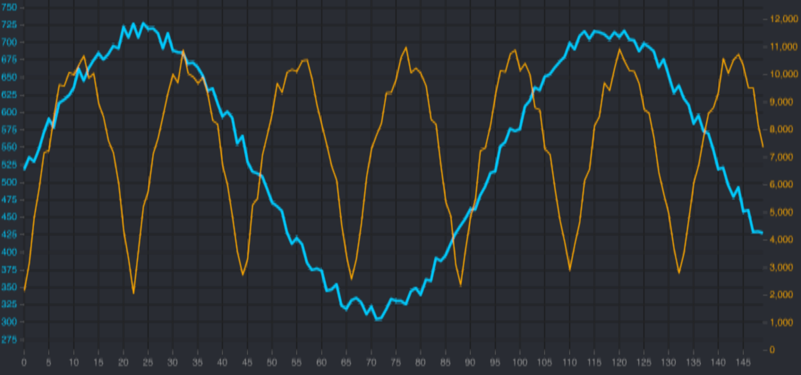

# ink-uplot

[](https://www.npmjs.com/package/ink-uplot)
[](https://www.npmjs.com/package/ink-uplot)
[](./LICENSE)
[](https://www.npmjs.com/package/ink-uplot)

**Render [uPlot](https://github.com/leeoniya/uPlot) charts in the terminal** with [React Ink](https://github.com/vadimdemedes/ink). Reuse your existing browser uPlot config — series, axes, scales — and get pixel-accurate, truecolor terminal charts. Auto-detects the best output for your terminal: **Unicode block art**, or native **kitty / sixel / iTerm2 graphics protocols** for real inline images.

A terminal charting / TUI dataviz library for Node.js — line charts, time series, live-updating dashboards, and trading-style plots, straight in your CLI.




## Why ink-uplot?

- **Real uPlot config, not a new API** — paste the same `opts`/`data` you'd use in the browser. Series, scales, dual axes, custom tick formatters all work.
- **Truecolor & graphics protocols** — beyond ASCII/Unicode: emit real images via the kitty, sixel, and iTerm2 inline-image protocols, auto-detected per terminal.
- **Built for live data** — update the `data` prop to animate; designed for streaming, real-time dashboards.
- **Composable** — it's a normal Ink `<Box>`/`<Text>` component; embed it in any TUI layout.
- **TypeScript-first**, ESM, fully typed.

## Install

```bash
npm install ink-uplot uplot ink react
```

`uplot`, `ink`, and `react` are peer dependencies. `canvas` ([node-canvas](https://github.com/Automattic/node-canvas)) is pulled in automatically but needs system libraries (Cairo, Pango):

- **macOS:** `brew install pkg-config cairo pango`
- **Debian/Ubuntu:** `sudo apt-get install build-essential libcairo2-dev libpango1.0-dev`
- See [node-canvas compiling](https://github.com/Automattic/node-canvas#compiling) for other platforms.

## Quick Start

```tsx
import React from 'react';
import { render } from 'ink';
import { InkUPlot } from 'ink-uplot';

const opts = {
  series: [
    {},
    { stroke: 'cyan', label: 'Price', width: 2 },
  ],
  axes: [
    { stroke: '#555', grid: { stroke: '#333' } },
    { stroke: '#555', grid: { stroke: '#333' } },
  ],
};

const data = [
  [1, 2, 3, 4, 5, 6, 7, 8, 9, 10],           // x values
  [10, 25, 15, 30, 20, 35, 25, 40, 30, 45],  // y values
];

function App() {
  return <InkUPlot opts={opts} data={data} width={80} height={24} />;
}

render(<App />);
```

## Terminal formats

ink-uplot picks the highest-fidelity output your terminal supports and falls back gracefully. Detection is automatic (`detectFormat()`), or force one with the `format` prop.

| Format | What it is | Terminals |
|--------|-----------|-----------|
| `symbols` | Truecolor Unicode block art (via [chafa](https://github.com/hectorm/chafa-wasm)) | **Any** terminal — universal fallback |
| `kitty` | [kitty graphics protocol](https://sw.kovidgoyal.net/kitty/graphics-protocol/) | kitty, Ghostty, Konsole |
| `sixels` | Sixel graphics | foot, Windows Terminal, xterm (+sixel) |
| `iterm2` | iTerm2 inline images | iTerm2, WezTerm, VS Code |

```tsx
// Force a format instead of auto-detecting:
<InkUPlot opts={opts} data={data} format="symbols" />
```

## Props

| Prop | Type | Default | Description |
|------|------|---------|-------------|
| `opts` | `uPlot.Options` | *required* | Standard uPlot options. Interactive options (cursor, select, legend) are stripped automatically. |
| `data` | `uPlot.AlignedData` | *required* | uPlot data array — identical to browser uPlot. |
| `width` | `number` | `stdout.columns` or `80` | Chart width in terminal columns. |
| `height` | `number` | `24` | Chart height in terminal rows. |
| `format` | `'symbols' \| 'kitty' \| 'sixels' \| 'iterm2'` | auto-detected | Output format for the current terminal. |
| `showAxes` | `boolean` | `true` | Render text axes around the chart. `false` for a borderless chart. |
| `color` | `boolean` | `true` | Enable truecolor ANSI output. |

## Features

- **Truecolor rendering** — 24-bit color Unicode block art, or real inline images via graphics protocols.
- **Text axes** — Y-axis labels (left and/or right) and X-axis ticks render as real, copy-pasteable text.
- **Dual Y-axis** — put scales on the left, right, or both via uPlot's `scale` and `side` config.
- **Timestamp auto-detection** — unix-timestamp X values are formatted as dates automatically.
- **Custom axis formatters** — set `values` on an axis to control tick labels (e.g. `mm:ss`).
- **Live / streaming data** — update the `data` prop to animate; resize-aware.
- **Responsive** — follows terminal resize when `width` isn't fixed.

## Examples

Run any example with `npx tsx examples/<name>.tsx`. Press `q` to quit.

| Example | Description |
|---------|-------------|
| [`basic-line.tsx`](examples/basic-line.tsx) | Simple sine wave with axes |
| [`multi-series.tsx`](examples/multi-series.tsx) | Three overlapping series |
| [`dual-y-axis.tsx`](examples/dual-y-axis.tsx) | Price (left) + Volume (right) Y-axis |
| [`shaded-area.tsx`](examples/shaded-area.tsx) | Area charts with translucent fill |
| [`timestamps.tsx`](examples/timestamps.tsx) | 90-day time series with date X-axis |
| [`live-trading.tsx`](examples/live-trading.tsx) | Streaming data at 100ms, mm:ss X-axis, highlighted last value |
| [`no-axes.tsx`](examples/no-axes.tsx) | Minimal borderless chart (`showAxes={false}`) |
| [`line-width-test.tsx`](examples/line-width-test.tsx) | Interactive line-width comparison (arrow keys) |


## How it works

1. A minimal DOM shim provides fake `document`/`window` globals so uPlot can initialize in Node.js.
2. uPlot renders your series onto a [node-canvas](https://github.com/Automattic/node-canvas) instance.
3. The canvas pixel buffer is extracted (`getImageData`, or a native PNG for iTerm2).
4. For `symbols`/`kitty`/`sixels`, [chafa-wasm](https://github.com/hectorm/chafa-wasm) converts pixels to truecolor terminal output; for `iterm2` the PNG is sent inline.
5. Text axes are computed separately (nice-numbers tick algorithm) and rendered as Ink `<Text>`.
6. Everything is composed via Ink `<Box>`/`<Text>` layout.

## Lower-level API

For custom pipelines, the internals are exported:

```ts
import {
  renderToImageData,
  renderToPNG,
  pixelsToTerminal,
  detectFormat,
} from 'ink-uplot';

// uPlot → pixel buffer
const imageData = await renderToImageData(opts, data, 640, 384);

// pixels → terminal output (symbols / kitty / sixels)
const ansi = await pixelsToTerminal(imageData, { width: 80, height: 24, colors: 'truecolor' });
console.log(ansi);

// uPlot → PNG buffer (used by the iTerm2 fast path)
const png = await renderToPNG(opts, data, 640, 384);
```

## Tips

- **Series colors:** high-contrast colors (`'cyan'`, `'#ff0000'`, `'#00ff88'`) read best.
- **Embedding:** the component occupies exactly its `width` × `height` in cells — wrap it in an Ink `<Box>` to place it in a larger layout.
- **Shaded areas:** use `fill` with alpha ≥ 0.3 (e.g. `'rgba(0, 200, 255, 0.4)'`); very low alpha may not be visible.
- **Formats:** if a terminal misdetects, pass `format` explicitly. `symbols` works everywhere.

## Requirements

- Node.js >= 18
- System libraries for [node-canvas](https://github.com/Automattic/node-canvas#compiling) (Cairo, Pango)

## License

[MIT](./LICENSE)
