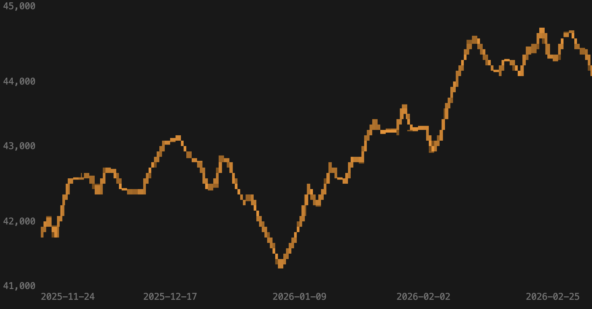
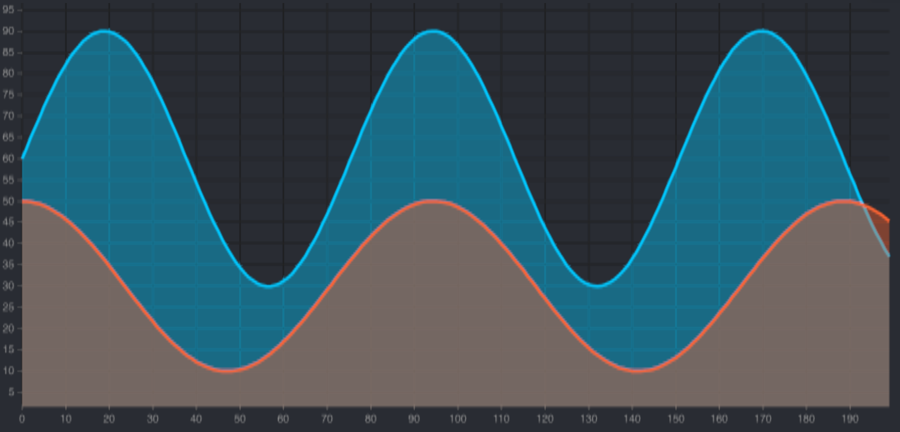
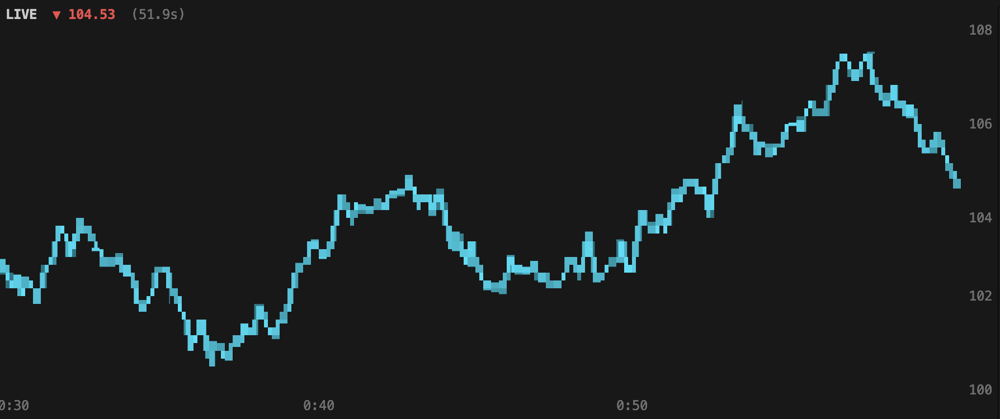

# ink-uplot

Render [uPlot](https://github.com/leeoniya/uPlot) charts in the terminal using [React Ink](https://github.com/vadimdemedes/ink). Reuse your existing browser uPlot configuration objects — series, axes, scales — and get high-fidelity terminal charts with truecolor support via [chafa-wasm](https://github.com/nicholasgasior/chafa-wasm).



## Install

```bash
pnpm add ink-uplot uplot canvas ink react
```

> **Note:** `canvas` ([node-canvas](https://github.com/Automattic/node-canvas)) requires system dependencies (Cairo, Pango). See [node-canvas installation](https://github.com/Automattic/node-canvas#compiling) for platform-specific instructions. On macOS: `brew install pkg-config cairo pango`.

## Quick Start

```tsx
import React from 'react';
import { render } from 'ink';
import { InkUPlot } from 'ink-uplot';

const opts = {
  series: [
    {},
    { stroke: 'cyan', label: 'Price', width: 2 },
  ],
  axes: [
    { stroke: '#555', grid: { stroke: '#333' } },
    { stroke: '#555', grid: { stroke: '#333' } },
  ],
};

const data = [
  [1, 2, 3, 4, 5, 6, 7, 8, 9, 10],  // x values
  [10, 25, 15, 30, 20, 35, 25, 40, 30, 45],  // y values
];

function App() {
  return <InkUPlot opts={opts} data={data} width={80} height={24} />;
}

render(<App />);
```

## How It Works

1. A minimal DOM shim provides fake `document`/`window` globals so uPlot can initialize in Node.js
2. uPlot renders series data onto a [node-canvas](https://github.com/Automattic/node-canvas) instance
3. The canvas pixel buffer is read via `getImageData()`
4. [chafa-wasm](https://github.com/nicholasgasior/chafa-wasm) converts pixels to truecolor Unicode block art
5. Text-based axes (Y-axis labels, X-axis ticks) are calculated separately and rendered as Ink `<Text>` components
6. Output is composed via Ink `<Box>` / `<Text>` layout

## Props

| Prop | Type | Default | Description |
|------|------|---------|-------------|
| `opts` | `uPlot.Options` | *required* | Standard uPlot options. Interactive options (cursor, select, legend) are automatically stripped. |
| `data` | `uPlot.AlignedData` | *required* | uPlot data array — same format as browser uPlot. |
| `width` | `number` | `stdout.columns` or `80` | Chart width in terminal columns. |
| `height` | `number` | `24` | Chart height in terminal rows. |
| `threshold` | `number` | `128` | Luminance threshold (0-255) for pixel-to-dot conversion. Lower = more dots. |
| `showAxes` | `boolean` | `true` | Show text axes around the chart. Set to `false` for a borderless chart. |
| `color` | `boolean` | `true` | Enable truecolor ANSI output. |
| `background` | `'dark' \| 'light'` | `'dark'` | Terminal background. `'dark'` renders light-on-dark; `'light'` inverts. |

## Features

- **Truecolor rendering** — chafa-wasm produces high-fidelity Unicode block art with 24-bit color
- **Text axes** — Y-axis labels (left and/or right) and X-axis ticks are rendered as real text, not pixels
- **Dual Y-axis** — put scales on left, right, or both using uPlot's `scale` and `side` axis config
- **Timestamp auto-detection** — unix timestamp x-values are automatically formatted as dates
- **Custom axis formatters** — set `values` on axes to control tick label formatting (e.g., `mm:ss`)
- **Live data** — update `data` prop to animate; the component re-renders on prop changes
- **Responsive** — listens to terminal resize when `width` is not fixed

## Examples

Run any example with `npx tsx examples/<name>.tsx`. Press `q` to quit.

| Example | Description |
|---------|-------------|
| [`basic-line.tsx`](examples/basic-line.tsx) | Simple sine wave with axes |
| [`multi-series.tsx`](examples/multi-series.tsx) | Three overlapping series |
| [`dual-y-axis.tsx`](examples/dual-y-axis.tsx) | Price (left) + Volume (right) Y-axis |
| [`shaded-area.tsx`](examples/shaded-area.tsx) | Area charts with translucent fill |
| [`timestamps.tsx`](examples/timestamps.tsx) | 90-day time series with date X-axis |
| [`live-trading.tsx`](examples/live-trading.tsx) | Streaming data at 100ms, mm:ss X-axis, highlighted last value |
| [`no-axes.tsx`](examples/no-axes.tsx) | Minimal borderless chart (`showAxes={false}`) |
| [`line-width-test.tsx`](examples/line-width-test.tsx) | Interactive line width comparison (arrow keys to adjust) |





## Lower-Level API

For custom pipelines, the internal functions are exported:

```ts
import { renderToImageData, pixelsToTerminal, pixelsToBraille, sampleCellColors } from 'ink-uplot';

// Render uPlot to a pixel buffer
const imageData = await renderToImageData(opts, data, 640, 384);

// Convert to truecolor terminal output via chafa
const ansi = await pixelsToTerminal(imageData, {
  width: 80,
  height: 24,
  colors: 'truecolor',
});
console.log(ansi);

// Or convert to Braille (lower fidelity, no deps)
const braille = pixelsToBraille(imageData, { threshold: 100 });
console.log(braille.text);
```

## Tips

- **Series colors:** Use high-contrast colors (`'cyan'`, `'#ff0000'`, `'#00ff88'`) for best visibility.
- **Embedded charts:** The component only occupies its `width` x `height` in terminal cells. Wrap in an Ink `<Box>` to embed in larger layouts.
- **Shaded areas:** Use `fill` on series with alpha >= 0.3 (e.g., `'rgba(0, 200, 255, 0.4)'`). Very low alpha values may not be visible.
- **Performance:** Rendering is async. The component shows "Rendering chart..." until the first frame is ready.
- **Axes:** Set `showAxes={false}` to hide text axes entirely, or configure individual axes via uPlot's axes config.

## Requirements

- Node.js >= 18
- System dependencies for [node-canvas](https://github.com/Automattic/node-canvas#compiling)

## License

ISC
